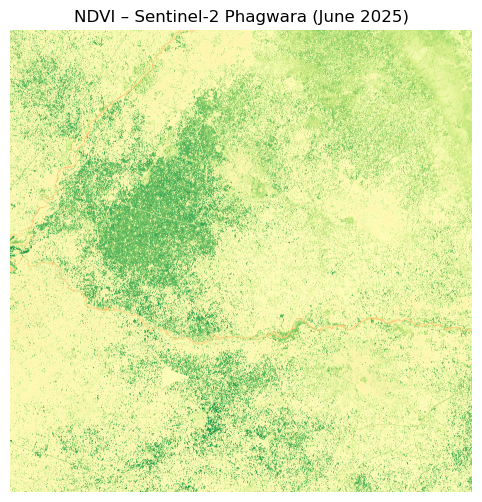

# 🌾 Sentinel-2 Super-Resolution for Phagwara Region

This project focuses on using deep learning to enhance the spatial resolution of **Sentinel-2 RGBN imagery** using **L1, perceptual, and NDVI-based loss functions**, inspired by the paper:

> Galar et al., *Super-Resolution of Sentinel-2 Images Using Convolutional Neural Networks and Real Ground Truth Data*, Remote Sensing 2020.

---

## 🛰 Dataset

- **Sentinel-2 L2A (BOA)** imagery from Copernicus Open Access Hub
- Area of Interest: *Phagwara, Punjab, India (Tile: T43REQ)*
- Date: `2025-06-02`
- Bands Used:  
  - `B02` (Blue)  
  - `B03` (Green)  
  - `B04` (Red)  
  - `B08` (Near Infrared)

---

## 🌱 NDVI Computation

The Normalized Difference Vegetation Index (NDVI) is computed as:

NDVI = (NIR - Red) / (NIR + Red)

Here is a preview of NDVI over Phagwara region:

  

---

## 🧠 Goal

Train a **CNN-based Super-Resolution model (EDSR)** using:
- **L1 Loss** (pixel-wise)
- **VGG Perceptual Loss** on RGB bands
- **NDVI Loss** for improving vegetation accuracy

---

## 📁 Structure
├── home.ipynb # Notebook: NDVI preview and setup
├── assets/
│ └── ndvi_phagwara_preview.png
├── .gitignore
└── README.md

---

## 🛠️ Work in Progress

✅ Sentinel-2 preprocessing  
✅ NDVI computation  
🚧 PlanetScope matching  
🚧 RGBN tiling & alignment  
🚧 EDSR model training with custom loss functions

---

## 📜 License

MIT License

